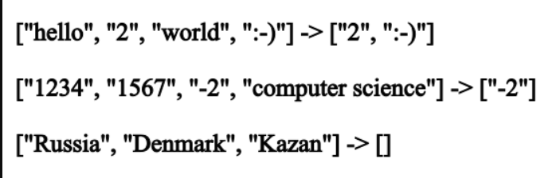

# Задача
***Написать программу, 
которая из имеющегося массива строк формирует массив из строк, 
длина которых меньше или равна 3 символа.***

## **Описание решения**
1. Задаем текстовый массив
2. Определяем количество элементов, в которых количество символов меньше трех.
3. Объявлем новый массив длиной равной количеству элементов из п.2
4. Наполняем новый массив такими элементами
5. Выводим новый массив

## **Объявленные переменные**

***array*** - имеющийся массив строк

***i*** - элемент имеющегося массива **array**

***count*** - счетчик количества элементов имеющегося массива **array**, в которых количество символов меньше трех, т.е. определяет длину искомого массива.

***result*** - новый искомый массив

## **Используемые методы**

***PrintArray*** - метод вывода массива

## **Примеры**

